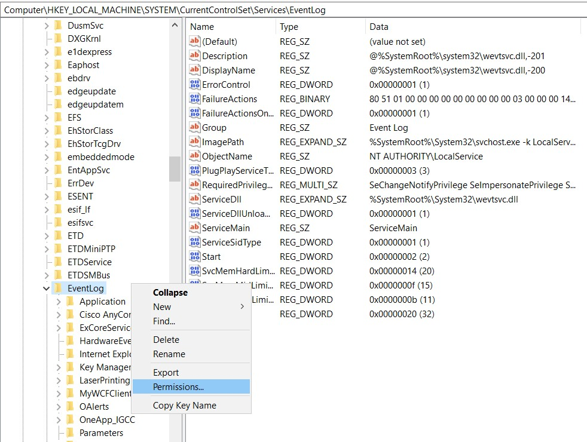

<h1 align="center">
  WIK Service Order Service </br>
  
  <a href="https://github.com/zulfikar4568/WIK.ServiceOrderMES/releases/latest"></a>
  <a href="https://github.com/zulfikar4568/WIK.ServiceOrderMES/blob/master/LICENSE"></a>
</h1>

# Change the Config of the Application
Edit the hosts in your `Endpoints.config`
```config
<endpoint address="https://<your server host>/CamstarWCFServices/DirectAccessService.svc"
```

And Edit the Configuration Application in `App.config`

# Enabled Event Log on windows Machine
- Log on to the computer as an administrator.
- Click Start, click Run, type Regedit in the Open box, and then click OK. - The Registry Editor window appears.
- Locate the following registry subkey
```
Computer\HKEY_LOCAL_MACHINE\SYSTEM\CurrentControlSet\Services\EventLog
```
- Right-click Eventlog, and then click Permissions. The Permissions for Eventlog dialog box appears.
  
<p align="center">
  <a href="" target="blank"></a>
</p>

- Click Add, add the user account or group that you want and set the following permissions: `Full Control`.

<p align="center">
  <a href="" target="blank"></a>
</p>

- Locate the following registry subkey
```
Computer\HKEY_LOCAL_MACHINE\SYSTEM\CurrentControlSet\Services\EventLog\Security
```
<p align="center">
  <a href="" target="blank"></a>
</p>

- Click Add, add the user account or group that you want and set the following permissions: `Full Control`.

<p align="center">
  <a href="" target="blank"></a>
</p>

# License & Copy Right
© M. Zulfikar Isnaen, This is Under [MIT License](LICENSE).
